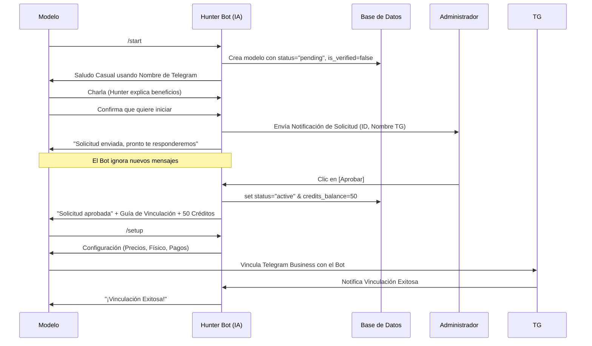

# Directiva: Flujo de Onboarding Cero-Fricción en el Bot de Telegram

> **Objetivo:** Definir la arquitectura y experiencia de usuario para la captación de modelos a través del Bot de Telegram, asegurando una separación clara entre el uso del Agente de Ventas con IA y la verificación de identidad (KYC), que ahora es responsabilidad exclusiva de la MiniApp.

## 1. Principios de Arquitectura (Separación de Preocupaciones - SOP)

*   **Identidad Exclusiva en la MiniApp:** La recolección de datos sensibles (nombre real, edad, país, foto de documento, video de verificación) **NUNCA** se realiza a través del chat de texto del Bot. Se procesa a través de los formularios seguros y cifrados de la MiniApp.
*   **Fricción Cero en el ChatBot:** El Bot de Telegram tiene como único propósito inicial "vender" la idea de usar a *Nebula IA* como asistente de ventas a la modelo, utilizando su nombre de usuario de Telegram para romper el hielo y enviando la solicitud al Administrador tan pronto como ella demuestra interés en probar el servicio.
*   **Aprobación Manual Centralizada:** Todo acceso a la IA de ventas está gobernado por una compuerta humana. El Bot es incapaz de activar de forma autónoma el agente a nuevas creadoras sin tu aprobación.
*   **Modelo de Negocio "Freemium" por Créditos:** Se atrae con 50 créditos gratuitos para que vean la magia funcionar, forzando luego a que dependan de los planes estructurados.

## 2. Diagrama de Flujo (Onboarding Bot Telegram)

## 3. Estados en Base de Datos para el Bot de Telegram

La tabla `models` juega un rol crucial para decidir si el Bot responde o no a los clientes de la modelo.

*   `status = 'pending'`: El Bot no inicia tareas de ventas, la modelo está esperando ser aprobada por el Admin.
*   `status = 'active'`: El Bot puede ejecutar sus flujos de ventas o el `/setup`, incluso si `is_verified=false`.
*   `is_verified = false`: Bandera que se mantiene en Falso hasta que la modelo complete el KYC completo a través de la interfaz web (MiniApp). Esto no bloquea su capacidad de probar la IA de Telegram con sus primeros clientes.
*   `credits_balance = 50`: Se entregan como cortesía tras la aprobación del administrador y se van gastando a razón de `-1` crédito por cada mensaje o réplica del Bot de la agencia, logrando cerrar una venta.

## 4. Agotamiento de Créditos

Cuando la modelo llega a 0 créditos `(credits_balance <= 0)`:
1.  **Detección Inmediata:** El script de `business_chat.py` intercepta el mensaje del cliente, verifica y corta el flujo, evitando que la IA de OpenAI genere costos operativos nulos de retorno.
2.  **Notificación Bilateral:** 
    *   **Para la Modelo:** Se le informa por el canal privado del bot que necesita recargar saldo y se le despliegan los paquetes (`credits.py`).
    *   **Para el Admin:** Se envía un aviso inmediato de "Modelo sin saldo", instando a contactarla por privado ("Tengo un cierre pendiente en mi OF, préstame, etc.") para reactivar sus poderes o lograr un pago al instante.

## 5. Próximas Mejoras Posibles

- Implementar validación automática de pagos por Crypto Pay.
- Notificaciones de bajo saldo (Ej: "Aviso: Te quedan 5 mensajes de IA").
