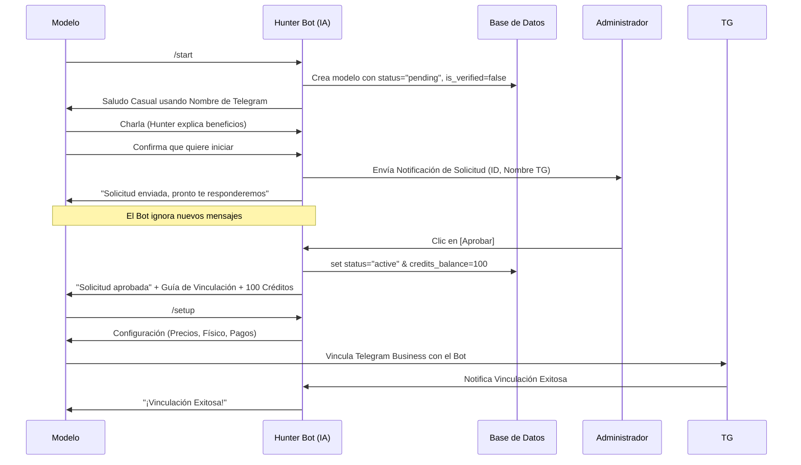

# Directiva: Flujo de Onboarding Cero-Fricción en el Bot de Telegram

> **Objetivo:** Definir la arquitectura y experiencia de usuario para la captación de modelos a través del Bot de Telegram, asegurando una separación clara entre el uso del Agente de Ventas con IA y la verificación de identidad (KYC), que ahora es responsabilidad exclusiva de la MiniApp.

## 1. Principios de Arquitectura (Separación de Preocupaciones - SOP)

*   **Identidad Exclusiva en la MiniApp:** La recolección de datos sensibles (nombre real, edad, país, foto de documento, video de verificación) **NUNCA** se realiza a través del chat de texto del Bot. Se procesa a través de los formularios seguros y cifrados de la MiniApp.
*   **Fricción Cero en el ChatBot:** El Bot de Telegram tiene como único propósito inicial "vender" la idea de usar a *Nebula IA* como asistente de ventas a la modelo, utilizando su nombre de usuario de Telegram para romper el hielo y enviando la solicitud al Administrador tan pronto como ella demuestra interés en probar el servicio.
*   **Aprobación Manual Centralizada:** Todo acceso a la IA de ventas está gobernado por una compuerta humana. El Bot es incapaz de activar de forma autónoma el agente a nuevas creadoras sin tu aprobación.
*   **Modelo de Negocio "Freemium" por Créditos:** Se atrae con 100 créditos gratuitos para que vean la magia funcionar, forzando luego a que dependan de los planes estructurados.

## 2. Diagrama de Flujo (Onboarding Bot Telegram)



## 3. Estados en Base de Datos para el Bot de Telegram

La tabla `models` juega un rol crucial para decidir si el Bot responde o no a los clientes de la modelo.

*   `status = 'pending'`: El Bot no inicia tareas de ventas, la modelo está esperando ser aprobada por el Admin.
*   `status = 'active'`: El Bot puede ejecutar sus flujos de ventas o el `/setup`, incluso si `is_verified=false`.
*   `is_verified = false`: Bandera que se mantiene en Falso hasta que la modelo complete el KYC completo a través de la interfaz web (MiniApp). Esto no bloquea su capacidad de probar la IA de Telegram con sus primeros clientes.
*   `credits_balance = 100`: Se entregan como cortesía tras la aprobación del administrador y se van gastando a razón de `-1` crédito por cada mensaje o réplica del Bot de la agencia, logrando cerrar una venta.

## 4. Agotamiento de Créditos

Cuando la modelo llega a 0 créditos `(credits_balance <= 0)`:
1.  **Detección Inmediata:** El script de `business_chat.py` intercepta el mensaje del cliente, verifica y corta el flujo, evitando que la IA de OpenAI genere costos operativos nulos de retorno.
2.  **Notificación Bilateral:** 
    *   **Para la Modelo:** Se le informa por el canal privado del bot que necesita recargar saldo y se le despliegan los paquetes (`credits.py`).
    *   **Para el Admin:** Se envía un aviso inmediato de "Modelo sin saldo", instando a contactarla por privado ("Tengo un cierre pendiente en mi OF, préstame, etc.") para reactivar sus poderes o lograr un pago al instante.

## 5. Comando /difusion — Difusión Masiva (Marketing)

El administrador puede enviar mensajes masivos a todas las modelos que hayan interactuado con el bot.

### Flujo:
1.  **`/difusion`**: El bot muestra la cantidad de destinatarias y pide el contenido.
2.  **Paso de Contenido**: El admin envía texto, foto, video o documento (con caption opcional).
3.  **Confirmación**: El bot muestra un resumen y pide escribir `SI` para confirmar.
4.  **Envío**: El bot itera sobre todas las modelos y reenvía el contenido, mostrando progreso.
5.  **Reporte**: Al final muestra un resumen de `enviados/total` y errores.

### Destinatarias:
Todas las modelos con `status IN ('prospect', 'pending', 'active')` — cualquier modelo que haya usado `/start` al menos una vez.

### Archivo: `src/handlers/admin.py`
- `difusion_handler` (ConversationHandler)
- `difusion_start`, `difusion_receive_content`, `difusion_confirm`, `difusion_cancel`

### Método BD: `get_all_models_for_broadcast()` en `src/services/database.py`

---

## 6. Corrección Crítica: Constraint de Status (2026-04-08)

**Bug**: El `CHECK` constraint de `models.status` **no incluía** el valor `'pending'`, lo que causaba que:
- `update_model(status="pending")` fallara silenciosamente.
- `/solicitudes` siempre retornara vacío.

**Fix**: Ejecutar la siguiente migración SQL:
```sql
ALTER TABLE models DROP CONSTRAINT IF EXISTS models_status_check;
ALTER TABLE models ADD CONSTRAINT models_status_check
  CHECK (status IN ('prospect', 'pending', 'verifying', 'active', 'rejected', 'paused'));
```

**Archivo**: `db/migration_add_pending_status.sql`

---

## 6.5 Corrección Crítica: Concurrencia de Aprobaciones (2026-04-08)

**Bug**: Solo la primera solicitud de aprobación funcionaba; las siguientes no hacían nada.

**Causa raíz** — Triple fallo:
1. **`query.answer()` doble**: Se llamaba `query.answer()` al inicio del handler (sin alert) y luego `query.answer(show_alert=True)` en los catch de errores. Telegram solo permite UNA respuesta por callback. La segunda llamada lanzaba `BadRequest` no capturado que mataba el handler.
2. **Catch-all tóxico**: Un `CallbackQueryHandler` sin patrón (catch-all) registrado al final de `bot.py` interceptaba TODOS los callbacks no manejados y llamaba `admin_callback_handler` causando comportamiento impredecible.
3. **Errores de `send_message` no aislados**: Si una modelo había bloqueado el bot, `send_message` lanzaba `Forbidden` que entraba al except y disparaba el doble-answer.

**Fix aplicado**:
- `query.answer()` se llama UNA SOLA VEZ, DESPUÉS de validaciones y ANTES de las acciones.
- Los errores de `send_message` se manejan con `notif_ok = False` sin llamar `query.answer()` de nuevo.
- El catch-all fue reemplazado por un handler de logging seguro `_unhandled_callback`.

**Regla de oro**: NUNCA llamar `query.answer()` más de una vez por callback.

---

## 7. Aprobación y Verificación Rápida de Modelos (Admin Only)

Para las modelos conocidas que no es necesario pasar por el riguroso proceso de KYC desde la MiniApp, se ha implementado el comando rápido de activación por Telegram.

### Comando: `/verificar_modelo <username_o_id>`
*   Se manda por mensaje directo al bot. Solo el administrador (`ADMIN_ID`) puede usarlo.
*   Acepta tanto el `@username` como el `telegram_id` de la creadora.
*   **Acciones que ejecuta:**
    1. Busca a la modelo con el username (sin el arroba) o parsea el ID si son puros números.
    2. Establece `is_verified = True`.
    3. Cambia `status = 'active'`.
    4. Agrega +100 a `credits_balance`.
    5. Envía un mensaje directo a la modelo felicitándola por su verificación y crédito inicial, invitándola a usar `/setup`.

---

## 8. Próximas Mejoras Posibles

- Implementar validación automática de pagos por Crypto Pay.
- Notificaciones de bajo saldo (Ej: "Aviso: Te quedan 5 mensajes de IA").
- Segmentación avanzada en difusiones (por status, por créditos, etc.).

---
*Última Actualización: 11 de Abril de 2026*
